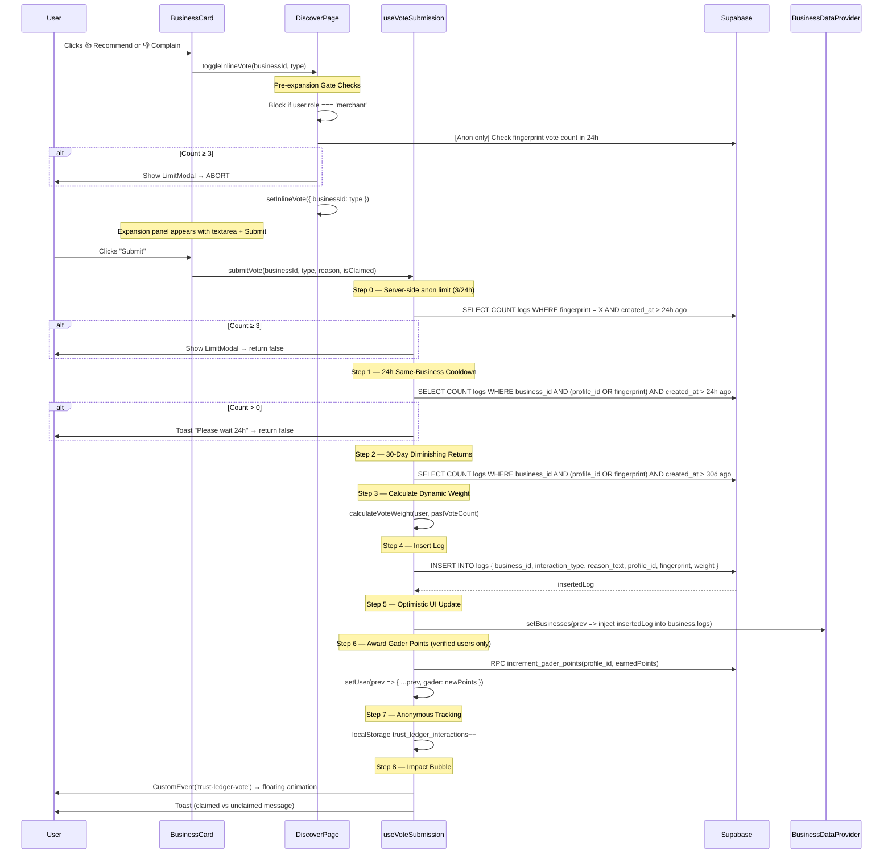
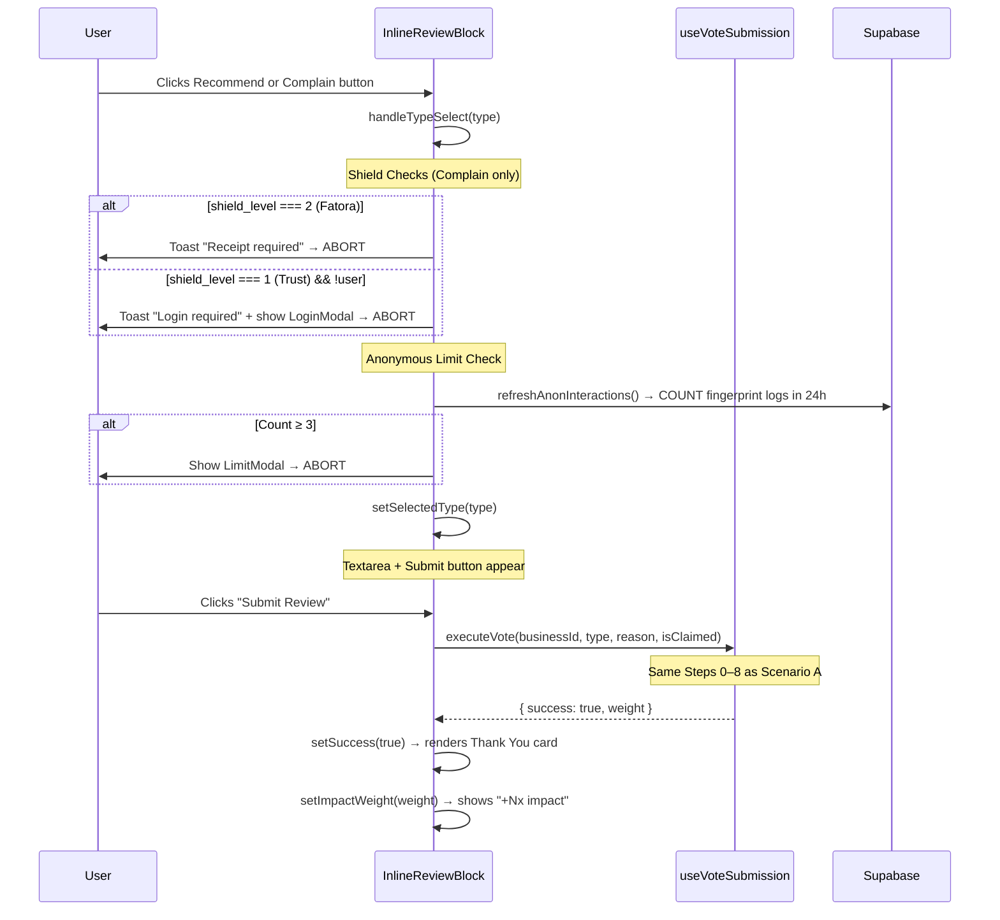
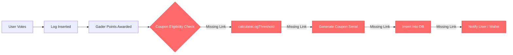
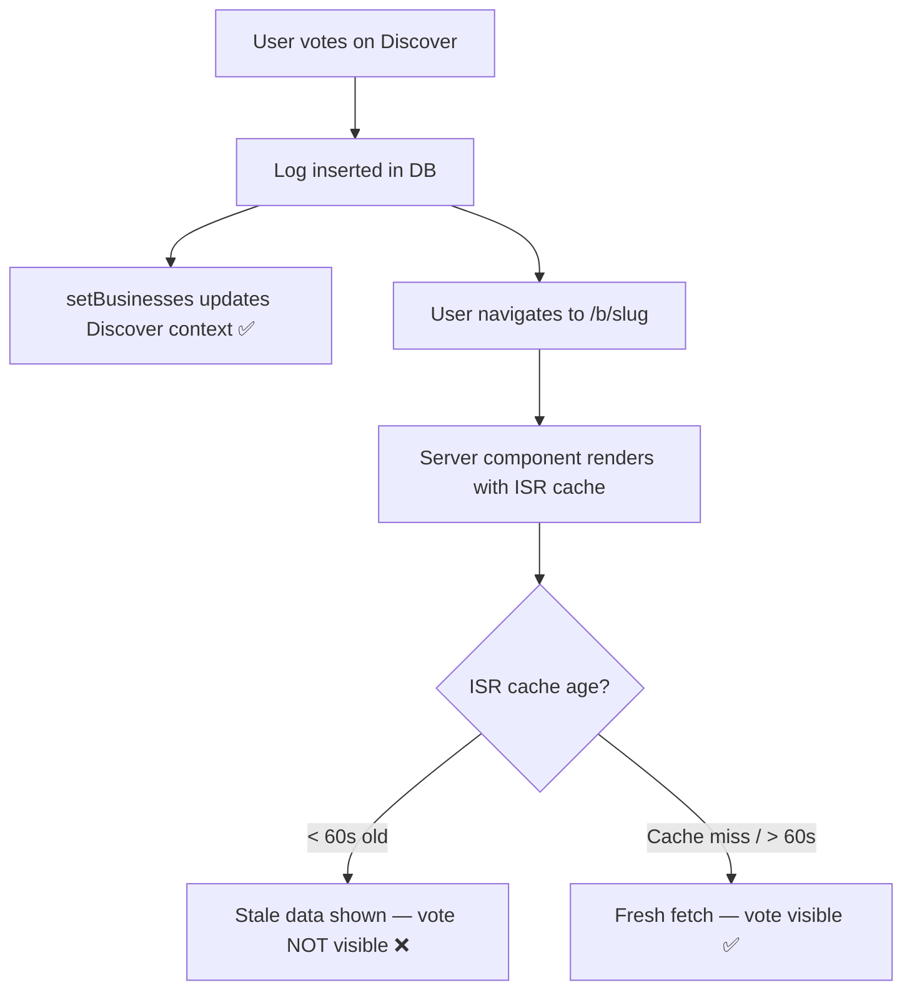

# Tagdeer Business Logic & Workflow Document
## Voting Mechanism + Coupon Dispenser Pipeline — Current State Extraction

> **Date:** 2026-03-18 · **Scope:** Read-only architecture analysis · **Branch:** `refactor-nextjs-phase2`

---

## 1. The Voting Workflows (Step-by-Step Scenarios)

### Scenario A: Discovery Page (`/discover`)

The Discover page is a **client component** that renders a grid of [BusinessCard](file:///Users/tbs_capsule/Desktop/tagdeer/Tagdeer-platfom/src/components/consumer/BusinessCard.jsx#10-322) components. Each card contains inline vote buttons (Recommend / Complain). The flow is:



#### Key state changes during Discover voting:

| Step | State Mutation | Location |
|------|---------------|----------|
| Pre-gate | `inlineVote[businessId]` = type | [discover/page.jsx](file:///Users/tbs_capsule/Desktop/tagdeer/Tagdeer-platfom/src/app/%28consumer%29/discover/page.jsx) local state |
| Log insert | `businesses[i].logs` prepended | [useVoteSubmission](file:///Users/tbs_capsule/Desktop/tagdeer/Tagdeer-platfom/src/hooks/useVoteSubmission.js#7-215) → `setBusinesses` |
| Points | `user.gader` updated | [useVoteSubmission](file:///Users/tbs_capsule/Desktop/tagdeer/Tagdeer-platfom/src/hooks/useVoteSubmission.js#7-215) → [setUser](file:///Users/tbs_capsule/Desktop/tagdeer/Tagdeer-platfom/src/app/%28consumer%29/b/%5Bslug%5D/InlineReviewBlock.jsx#26-27) |
| Anon count | `localStorage` + `anonInteractions` | [useVoteSubmission](file:///Users/tbs_capsule/Desktop/tagdeer/Tagdeer-platfom/src/hooks/useVoteSubmission.js#7-215) |
| UI bubble | `impactBubble` + `globalImpactBubble` | [useVoteSubmission](file:///Users/tbs_capsule/Desktop/tagdeer/Tagdeer-platfom/src/hooks/useVoteSubmission.js#7-215) + [layout.jsx](file:///Users/tbs_capsule/Desktop/tagdeer/Tagdeer-platfom/src/app/%28consumer%29/layout.jsx) |

---

### Scenario B: Storefront Page (`/b/[slug]`)

The Storefront is a **server component** (ISR, revalidate=60s) that pre-fetches business data, logs, and products. The interactive voting lives in the **client component** [InlineReviewBlock](file:///Users/tbs_capsule/Desktop/tagdeer/Tagdeer-platfom/src/app/%28consumer%29/b/%5Bslug%5D/InlineReviewBlock.jsx#10-211).



#### Critical difference from Scenario A:

| Aspect | Discover | Storefront |
|--------|----------|------------|
| **Rendering** | Client component (CSR) | Server component (ISR) + client island |
| **Data source** | [BusinessDataProvider](file:///Users/tbs_capsule/Desktop/tagdeer/Tagdeer-platfom/src/context/providers/BusinessDataProvider.jsx#8-236) context (real-time) | Server-fetched at build/revalidation |
| **[setUser](file:///Users/tbs_capsule/Desktop/tagdeer/Tagdeer-platfom/src/app/%28consumer%29/b/%5Bslug%5D/InlineReviewBlock.jsx#26-27) on points** | ✅ Updates user context | ❌ Passes [() => {}](file:///Users/tbs_capsule/Desktop/tagdeer/Tagdeer-platfom/src/context/providers/AuthProvider.jsx#15-25) no-op |
| **Shield checks** | In [openVoteModal](file:///Users/tbs_capsule/Desktop/tagdeer/Tagdeer-platfom/src/app/%28consumer%29/discover/page.jsx#136-165) (unused path now) | In [handleTypeSelect](file:///Users/tbs_capsule/Desktop/tagdeer/Tagdeer-platfom/src/app/%28consumer%29/b/%5Bslug%5D/InlineReviewBlock.jsx#67-94) |
| **Post-vote UI** | Inline panel closes, card stays | Entire block replaces with Thank You |

---

### State Synchronization Between Views

> [!CAUTION]
> **There is NO guaranteed state synchronization between Discover and Storefront.**

The two views operate in fundamentally different data planes:

1. **Discover page** reads from [BusinessDataProvider](file:///Users/tbs_capsule/Desktop/tagdeer/Tagdeer-platfom/src/context/providers/BusinessDataProvider.jsx#8-236) which holds client-side state and subscribes to Supabase Realtime channels (`public:businesses` and `public:logs`).

2. **Storefront page** is a **server component** that fetches data at build time (ISR, 60s revalidation). It does NOT consume [BusinessDataProvider](file:///Users/tbs_capsule/Desktop/tagdeer/Tagdeer-platfom/src/context/providers/BusinessDataProvider.jsx#8-236). The [InlineReviewBlock](file:///Users/tbs_capsule/Desktop/tagdeer/Tagdeer-platfom/src/app/%28consumer%29/b/%5Bslug%5D/InlineReviewBlock.jsx#10-211) client island uses [useVoteSubmission](file:///Users/tbs_capsule/Desktop/tagdeer/Tagdeer-platfom/src/hooks/useVoteSubmission.js#7-215) which calls `setBusinesses`, but this updates the **Discover page's** context — **not** the server-rendered storefront data.

**Navigation scenario:** If a user votes on Discover → navigates to Storefront:
- The storefront shows **stale ISR data** (up to 60s old)
- The vote IS visible in the database, but the server-rendered page won't reflect it until the next ISR revalidation
- If the user stays on storefront and votes there, `setBusinesses` updates Discover's context, so navigating BACK to Discover will show both votes

**Realtime backstop:** The [BusinessDataProvider](file:///Users/tbs_capsule/Desktop/tagdeer/Tagdeer-platfom/src/context/providers/BusinessDataProvider.jsx#8-236) subscribes to `postgres_changes` on the `logs` table (INSERT and UPDATE events), so any vote from any client will eventually propagate to the Discover context — but only for users who have the Discover page mounted.

---

## 2. Validations & Restriction Rules (The Guardrails)

### 2.1 Authentication Requirements

| Rule | Condition | Enforcement Point |
|------|-----------|-------------------|
| **Merchant block** | `user.role === 'merchant'` | [useVoteSubmission](file:///Users/tbs_capsule/Desktop/tagdeer/Tagdeer-platfom/src/hooks/useVoteSubmission.js#7-215) L48 + [discover/page.jsx](file:///Users/tbs_capsule/Desktop/tagdeer/Tagdeer-platfom/src/app/%28consumer%29/discover/page.jsx) L65 |
| **Anonymous allowed** | `!user` (null) | Allowed with restrictions below |
| **Login required for shielded complaints** | `shield_level >= 1 && !user` | [InlineReviewBlock](file:///Users/tbs_capsule/Desktop/tagdeer/Tagdeer-platfom/src/app/%28consumer%29/b/%5Bslug%5D/InlineReviewBlock.jsx#10-211) L74, [discover/page.jsx](file:///Users/tbs_capsule/Desktop/tagdeer/Tagdeer-platfom/src/app/%28consumer%29/discover/page.jsx) L143 |
| **Receipt required for Fatora complaints** | `shield_level === 2` | [InlineReviewBlock](file:///Users/tbs_capsule/Desktop/tagdeer/Tagdeer-platfom/src/app/%28consumer%29/b/%5Bslug%5D/InlineReviewBlock.jsx#10-211) L70, [discover/page.jsx](file:///Users/tbs_capsule/Desktop/tagdeer/Tagdeer-platfom/src/app/%28consumer%29/discover/page.jsx) L139 |

### 2.2 Time-Based Restrictions

| Rule | Window | Enforcement | File Reference |
|------|--------|-------------|----------------|
| **Anonymous global limit** | 3 votes per 24 hours per fingerprint | Server-side COUNT query | [useVoteSubmission L64-74](file:///Users/tbs_capsule/Desktop/tagdeer/Tagdeer-platfom/src/hooks/useVoteSubmission.js#L64-L74) |
| **Same-business cooldown** | 1 vote per 24 hours per business per user/fingerprint | Server-side COUNT query | [useVoteSubmission L77-96](file:///Users/tbs_capsule/Desktop/tagdeer/Tagdeer-platfom/src/hooks/useVoteSubmission.js#L77-L96) |
| **Diminishing returns** | Vote count in last 30 days on same business | Reduces weight, doesn't block | [useVoteSubmission L98-115](file:///Users/tbs_capsule/Desktop/tagdeer/Tagdeer-platfom/src/hooks/useVoteSubmission.js#L98-L115) |

### 2.3 Vote Weight Calculations

The weight is computed by [calculateVoteWeight(user, pastVoteCount)](file:///Users/tbs_capsule/Desktop/tagdeer/Tagdeer-platfom/src/lib/trustEngine.js#50-63) in [trustEngine.js](file:///Users/tbs_capsule/Desktop/tagdeer/Tagdeer-platfom/src/lib/trustEngine.js):

#### Tier Multiplier ([getTierMultiplier](file:///Users/tbs_capsule/Desktop/tagdeer/Tagdeer-platfom/src/lib/trustEngine.js#L16-L35)):

| Tier | From String | From Gader Points | Multiplier |
|------|-------------|-------------------|------------|
| Anonymous | `!user` | N/A | **0.2** |
| Bronze | default | 0–999 | **1.0** |
| Silver | `includes('silver')` | 1,000–4,999 | **1.5** |
| Gold | `includes('gold')` | 5,000–19,999 | **2.0** |
| VIP/Diamond | `includes('vip')` or `includes('diamond')` | 20,000+ | **2.5** |

> Takes `Math.max(tierFromString, tierFromPoints)` — whichever gives the user higher weight.

#### Diminishing Multiplier ([getDiminishingMultiplier](file:///Users/tbs_capsule/Desktop/tagdeer/Tagdeer-platfom/src/lib/trustEngine.js#L44-L48)):

| Past Votes (30d) | Multiplier |
|-------------------|------------|
| 0 | **1.0** |
| 1 | **0.5** |
| 2+ | **0.25** |

#### Final Weight:

```
finalWeight = round(tierMultiplier × diminishingMultiplier, 2)
```

**Examples:**
- Anonymous, first vote: `0.2 × 1.0 = 0.20`
- Gold user, first vote: `2.0 × 1.0 = 2.00`
- Silver user, 3rd vote on same business in 30d: `1.5 × 0.25 = 0.38`

#### Gader Points Awarded per Vote ([useVoteSubmission L170](file:///Users/tbs_capsule/Desktop/tagdeer/Tagdeer-platfom/src/hooks/useVoteSubmission.js#L170)):

```javascript
earnedPoints = Math.max(5, Math.min(25, Math.round(weight * 10)));
// Range: 5–25 points per vote, proportional to weight
```

### 2.4 Content Integrity

- [contentFilter.js](file:///Users/tbs_capsule/Desktop/tagdeer/Tagdeer-platfom/src/lib/contentFilter.js) implements bilingual bad word detection (English with `\b` boundaries, Arabic with Unicode-aware boundaries)
- **However:** [containsBadWords()](file:///Users/tbs_capsule/Desktop/tagdeer/Tagdeer-platfom/src/lib/contentFilter.js#38-45) is **NOT called anywhere in the voting pipeline.** The filter exists but is not wired into [useVoteSubmission](file:///Users/tbs_capsule/Desktop/tagdeer/Tagdeer-platfom/src/hooks/useVoteSubmission.js#7-215) or [InlineReviewBlock](file:///Users/tbs_capsule/Desktop/tagdeer/Tagdeer-platfom/src/app/%28consumer%29/b/%5Bslug%5D/InlineReviewBlock.jsx#10-211).

> [!WARNING]
> The content filter is defined but **never invoked** during vote submission. Logs with prohibited content are inserted without flagging.

### 2.5 Device / Geographic Restrictions

| Restriction | Status |
|------------|--------|
| **Device fingerprinting** | ✅ Active — localStorage-based UUID + UA hash via [fingerprint.js](file:///Users/tbs_capsule/Desktop/tagdeer/Tagdeer-platfom/src/lib/fingerprint.js) |
| **IP-based restrictions** | ❌ None for voting (only exists for catalog product reactions) |
| **Geographic restrictions** | ❌ None implemented |

---

## 3. The Coupon Dispenser Mechanism (The Reward Pipeline)

### 3.1 Current State — Coupon Engine Components

The coupon system exists as **isolated utility functions** that are not yet wired into the voting pipeline:

#### [couponEngine.js](file:///Users/tbs_capsule/Desktop/tagdeer/Tagdeer-platfom/src/lib/couponEngine.js) — Three functions:

| Function | Purpose | Connected to Vote Pipeline? |
|----------|---------|---------------------------|
| [isEligibleForCoupon(user)](file:///Users/tbs_capsule/Desktop/tagdeer/Tagdeer-platfom/src/lib/couponEngine.js#12-29) | Checks `gader_points >= 50` and `status === 'Active'` | ❌ **Not called** |
| [calculateLogThreshold(difficultyLevel)](file:///Users/tbs_capsule/Desktop/tagdeer/Tagdeer-platfom/src/lib/couponEngine.js#30-41) | Returns `3 + difficultyLevel` (logs needed for next coupon) | ❌ **Not called** |
| [isHotCoupon(generatedAt, redeemedAt)](file:///Users/tbs_capsule/Desktop/tagdeer/Tagdeer-platfom/src/lib/couponEngine.js#42-60) | Returns `true` if redeemed within 48h | ❌ **Not called** |

#### [serialCodeGenerator.js](file:///Users/tbs_capsule/Desktop/tagdeer/Tagdeer-platfom/src/lib/serialCodeGenerator.js):

| Function | Purpose | Connected? |
|----------|---------|-----------|
| [generateCouponSerial(businessName)](file:///Users/tbs_capsule/Desktop/tagdeer/Tagdeer-platfom/src/lib/serialCodeGenerator.js#11-45) | Generates `TAG-{PREFIX}-{RANDOM}` codes using `crypto.getRandomValues()` | ❌ **Not called from vote flow** |

### 3.2 The Missing Pipeline

> [!IMPORTANT]
> **The coupon dispenser does NOT automatically trigger after a vote.** The [useVoteSubmission](file:///Users/tbs_capsule/Desktop/tagdeer/Tagdeer-platfom/src/hooks/useVoteSubmission.js#7-215) hook ends at Gader point awarding (Step 6) and never calls [couponEngine.js](file:///Users/tbs_capsule/Desktop/tagdeer/Tagdeer-platfom/src/lib/couponEngine.js).

**What exists vs what's missing:**



### 3.3 Coupon Eligibility — Designed (But Unwired) Logic

Based on [couponEngine.js](file:///Users/tbs_capsule/Desktop/tagdeer/Tagdeer-platfom/src/lib/couponEngine.js) and [AuthProvider.jsx](file:///Users/tbs_capsule/Desktop/tagdeer/Tagdeer-platfom/src/context/providers/AuthProvider.jsx) (which loads `coupon_difficulty_level` from profiles):

1. **Eligibility:** User needs `gader_points >= 50` AND `status === 'Active'`
2. **Threshold:** `logsNeeded = 3 + coupon_difficulty_level` — each coupon earned increases difficulty by 1
3. **Hot Coupon Bonus:** If redeemed within 48h of generation → 1.5x value multiplier
4. **Serial Format:** `TAG-{BIZ_PREFIX}-{CRYPTO_RANDOM_6}` (e.g., `TAG-CAF-8X99AB`)

### 3.4 Profile Fields Ready for Coupon System

The [AuthProvider](file:///Users/tbs_capsule/Desktop/tagdeer/Tagdeer-platfom/src/context/providers/AuthProvider.jsx#11-451) already loads these coupon-related fields into the user object:
- `user.weekly_log_count` — tracks logs this week
- `user.coupon_difficulty_level` — escalating difficulty curve
- `user.gader` — Gader points balance

---

## 4. Critical Analysis & Overlapping Actions

### 4.1 ⚡ Rapid Fire Voting

**Question:** What happens if a user clicks Recommend and Complain rapidly before the first API call resolves?

**Answer — Two separate attack surfaces:**

#### A. Discover Page (BusinessCard):
- The [toggleInlineVote](file:///Users/tbs_capsule/Desktop/tagdeer/Tagdeer-platfom/src/app/%28consumer%29/discover/page.jsx#57-96) function is **not debounced** and **not locked**
- Clicking Recommend opens the expansion panel with `setInlineVote({ [id]: 'recommend' })`
- Clicking Complain immediately replaces it with `setInlineVote({ [id]: 'complain' })`
- **But:** The actual `submitVote()` is only called when the user clicks the "Submit" button inside the expansion panel — so rapid-fire type switching is cosmetic-only
- **However:** If the user clicks Submit, then before the `await submitVote()` resolves, switches type and clicks Submit again — **there is no mutex**. The `inlineSubmitting` boolean prevents double-submission on the same panel, but switching types resets it

#### B. Storefront Page (InlineReviewBlock):
- [handleTypeSelect](file:///Users/tbs_capsule/Desktop/tagdeer/Tagdeer-platfom/src/app/%28consumer%29/b/%5Bslug%5D/InlineReviewBlock.jsx#67-94) is async (checks limits)
- [handleSubmit](file:///Users/tbs_capsule/Desktop/tagdeer/Tagdeer-platfom/src/app/%28consumer%29/layout.jsx#144-175) has a `loading` state guard — **but** `selectedType` can be changed while loading is true since [handleTypeSelect](file:///Users/tbs_capsule/Desktop/tagdeer/Tagdeer-platfom/src/app/%28consumer%29/b/%5Bslug%5D/InlineReviewBlock.jsx#67-94) doesn't check `loading`
- **Race condition:** User selects Recommend → clicks Submit → `loading=true` → immediately clicks Complain button → `setSelectedType('complain')` — the in-flight submit uses the OLD type (captured by closure), but the UI shows the new type

> [!CAUTION]
> **No mutex/lock exists on the submit flow.** The `loading` flag only disables the Submit button, not the type-selection buttons. A rapid-fire user could theoretically submit two logs in quick succession by exploiting the time window between `setLoading(false)` and the success render.

**Actual risk level:** **LOW-MEDIUM.** The 24h same-business cooldown on the server side will reject the second insert. But the first insert's type could be wrong if the user changed it mid-flight.

---

### 4.2 🔄 State Desync (Discover ↔ Storefront)

**Question:** If a user upvotes on Discover, then instantly navigates to the Storefront, is the state guaranteed to reflect the vote?

**Answer: NO — there is a guaranteed desync window.**



**Root cause:** The Storefront page (`/b/[slug]/page.jsx`) is a **server component** with `export const revalidate = 60`. It creates its own Supabase client and fetches data independently. It does NOT consume the [BusinessDataProvider](file:///Users/tbs_capsule/Desktop/tagdeer/Tagdeer-platfom/src/context/providers/BusinessDataProvider.jsx#8-236) context.

**Specific gaps:**

| Data Point | Discover | Storefront |
|-----------|----------|------------|
| Business `recommends`/`complains` counts | Context + Realtime | Server-fetched (stale up to 60s) |
| Log entries list | Context (optimistic + Realtime) | Server-fetched (stale up to 60s) |
| Gader Index score | Calculated client-side from logs | Calculated server-side from `recommends`/`complains` columns |
| Vote weight in UI | Reflected immediately (impact bubble) | Not shown on storefront |

**Additional desync risk:** The Discover page computes the Gader Index from `business.display_score` (a database column), while the Storefront computes it from [(recommends / totalVotes) * 100](file:///Users/tbs_capsule/Desktop/tagdeer/Tagdeer-platfom/src/context/providers/AuthProvider.jsx#15-25) using raw vote counts. **These two formulas can produce different numbers** if `display_score` isn't updated in sync with the vote counts.

---

### 4.3 🎰 Coupon Exploitation Analysis

**Question:** Are there logical loopholes where a user could manipulate the vote payload to force the dispenser to drop a high-value coupon?

**Answer: The coupon dispenser is NOT connected to the vote pipeline, so this attack surface doesn't exist yet.** But analyzing the designed (unwired) logic:

#### Potential vulnerabilities if wired as-is:

1. **Weight manipulation via client:** [calculateVoteWeight()](file:///Users/tbs_capsule/Desktop/tagdeer/Tagdeer-platfom/src/lib/trustEngine.js#50-63) runs client-side. The weight value is computed locally and sent to Supabase in the INSERT payload. **There is no server-side validation** that the weight matches the expected formula.

   > [!CAUTION]
   > A user could intercept the Supabase INSERT and send `weight: 999` because the weight column is written by the client, not a database trigger or server function.

2. **Gader point inflation:** Points are awarded via `supabase.rpc('increment_gader_points')` — this is atomic and server-side ✅. But the `earnedPoints` calculation (`Math.round(weight * 10)`, clamped 5–25) is computed **client-side**, meaning a manipulated weight value would inflate points.

3. **Difficulty level reset:** `coupon_difficulty_level` is stored in the `profiles` table. If a user has direct Supabase access (anon key + known table name), they could potentially SET it to 0 to reset the difficulty curve — making coupons easier to earn. This depends entirely on RLS policies.

4. **Fingerprint spoofing:** The anonymous fingerprint is a `localStorage` value. Clearing localStorage generates a new fingerprint, effectively resetting the 3-vote/24h anonymous limit. This is a **known weakness** of client-side fingerprinting.

5. **Threshold gaming (designed, not wired):** [calculateLogThreshold(difficultyLevel)](file:///Users/tbs_capsule/Desktop/tagdeer/Tagdeer-platfom/src/lib/couponEngine.js#30-41) returns `3 + difficulty`. A new user gets a coupon after 3 logs. Since `weekly_log_count` is loaded but never checked in the vote pipeline, there's no weekly cap on log-based coupon earning.

---

### 4.4 Additional Architectural Concerns

#### A. Double Anonymous Limit Check

The anonymous vote limit (3/24h) is checked **twice** in the Discover flow:
1. In [toggleInlineVote()](file:///Users/tbs_capsule/Desktop/tagdeer/Tagdeer-platfom/src/app/%28consumer%29/discover/page.jsx#57-96) (before expanding the panel) — [discover/page.jsx L74-91](file:///Users/tbs_capsule/Desktop/tagdeer/Tagdeer-platfom/src/app/(consumer)/discover/page.jsx#L74-L91)
2. In `useVoteSubmission.submitVote()` (before inserting) — [useVoteSubmission L64-74](file:///Users/tbs_capsule/Desktop/tagdeer/Tagdeer-platfom/src/hooks/useVoteSubmission.js#L64-L74)

This is **defensive** but wasteful — two DB round-trips for the same check.

#### B. Orphaned VoteModal Path

The consumer [layout.jsx](file:///Users/tbs_capsule/Desktop/tagdeer/Tagdeer-platfom/src/app/%28consumer%29/layout.jsx) renders `<VoteModal>` and wires [openVoteModal](file:///Users/tbs_capsule/Desktop/tagdeer/Tagdeer-platfom/src/app/%28consumer%29/discover/page.jsx#136-165) → `submitVote`, but [openVoteModal](file:///Users/tbs_capsule/Desktop/tagdeer/Tagdeer-platfom/src/app/%28consumer%29/discover/page.jsx#136-165) in [discover/page.jsx](file:///Users/tbs_capsule/Desktop/tagdeer/Tagdeer-platfom/src/app/%28consumer%29/discover/page.jsx) is passed to [BusinessCard](file:///Users/tbs_capsule/Desktop/tagdeer/Tagdeer-platfom/src/components/consumer/BusinessCard.jsx#10-322) which **never calls it** (BusinessCard uses inline voting instead). The VoteModal is a legacy path that still renders but is never triggered from the current Discover UI.

#### C. [setUser](file:///Users/tbs_capsule/Desktop/tagdeer/Tagdeer-platfom/src/app/%28consumer%29/b/%5Bslug%5D/InlineReviewBlock.jsx#26-27) Noop in Storefront

[InlineReviewBlock](file:///Users/tbs_capsule/Desktop/tagdeer/Tagdeer-platfom/src/app/%28consumer%29/b/%5Bslug%5D/InlineReviewBlock.jsx#10-211) passes `setUser: () => {}` to [useVoteSubmission](file:///Users/tbs_capsule/Desktop/tagdeer/Tagdeer-platfom/src/hooks/useVoteSubmission.js#7-215). This means Gader points are awarded in the DB but **not reflected in the UI** until the user navigates away and back (triggering [AuthProvider](file:///Users/tbs_capsule/Desktop/tagdeer/Tagdeer-platfom/src/context/providers/AuthProvider.jsx#11-451) Phase 2 re-enrichment).

#### D. Content Filter Not Wired

[contentFilter.js](file:///Users/tbs_capsule/Desktop/tagdeer/Tagdeer-platfom/src/lib/contentFilter.js) ([containsBadWords()](file:///Users/tbs_capsule/Desktop/tagdeer/Tagdeer-platfom/src/lib/contentFilter.js#38-45)) is defined but never imported or called in:
- [useVoteSubmission.js](file:///Users/tbs_capsule/Desktop/tagdeer/Tagdeer-platfom/src/hooks/useVoteSubmission.js)
- [InlineReviewBlock.jsx](file:///Users/tbs_capsule/Desktop/tagdeer/Tagdeer-platfom/src/app/%28consumer%29/b/%5Bslug%5D/InlineReviewBlock.jsx)
- [BusinessCard.jsx](file:///Users/tbs_capsule/Desktop/tagdeer/Tagdeer-platfom/src/components/consumer/BusinessCard.jsx)
- [discover/page.jsx](file:///Users/tbs_capsule/Desktop/tagdeer/Tagdeer-platfom/src/app/%28consumer%29/discover/page.jsx)

**Any text — including prohibited slang — is inserted directly into the `logs` table without filtering.**

#### E. No Server-Side Weight Validation

The `weight` field in the log INSERT is computed entirely on the client. There is:
- No database trigger to validate it
- No RPC function that computes it server-side
- No RLS policy that constrains its range

A Supabase client with the anon key could insert a log with an arbitrary weight value.

---

## Summary: Architecture Risk Matrix

| Risk | Severity | Exploitability | Status |
|------|----------|----------------|--------|
| Content filter not wired | 🟡 Medium | Trivial — just submit bad words | **Unmitigated** |
| Client-side weight calculation | 🔴 High | Requires Supabase API knowledge | **Unmitigated** |
| Fingerprint spoofing (clear localStorage) | 🟡 Medium | Trivial | **Inherent to design** |
| ISR desync (Discover ↔ Storefront) | 🟡 Medium | Not exploitable, UX issue | **By design** |
| Gader point inflation via weight | 🔴 High | Same as weight manipulation | **Unmitigated** |
| Coupon pipeline not connected | 🟢 Info | N/A | **Intentionally staged** |
| Double anonymous limit DB queries | 🟢 Low | N/A (performance only) | **Defensive** |
| No mutex on rapid vote submission | 🟡 Medium | Requires fast clicking | **Mitigated by 24h cooldown** |
| Orphaned VoteModal code path | 🟢 Low | N/A (dead code) | **Tech debt** |
| [setUser](file:///Users/tbs_capsule/Desktop/tagdeer/Tagdeer-platfom/src/app/%28consumer%29/b/%5Bslug%5D/InlineReviewBlock.jsx#26-27) noop in storefront points | 🟡 Medium | Not exploitable, UX issue | **By design** |
