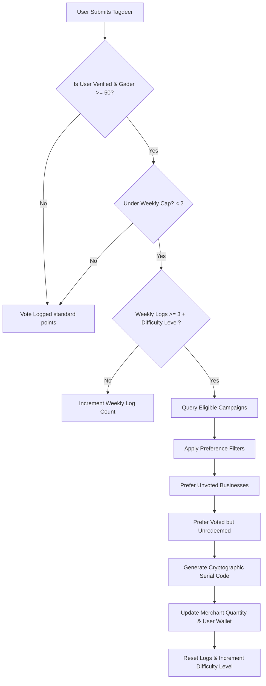

# 📖 Tagdeer Coupon & Campaign Engine: Dynamic Manual & Reference

This manual serves as the primary system reference for the **Tagdeer Coupon & Campaign Engine**. It is designed to explain the core mechanics from a User, Merchant, and Admin perspective, and document the database-driven dynamic configurations.

---

## ⚙️ 1. Dynamic Tier Configurations (Database-Driven)

Unlike traditional platforms with hardcoded rules, Tagdeer parameters are completely driven by the database in `public.platform_config` under the key `'tier_pricing'`. Admins can dynamically adjust features, limits, and reward structures directly in the table.

### 📊 System Tier Mappings (`platform_config` JSON structure)

```json
[
  {
    "id": "free", 
    "name": "Free", 
    "price": 0, 
    "duration": "monthly", 
    "allocations": {
      "max_locations": 1,
      "max_shields": 0,
      "max_campaigns": 0,
      "gader_points": 5
    },
    "features": ["1 Business Location", "Accept Reviews", "Basic Dashboard"],
    "isActive": true
  },
  {
    "id": "pro", 
    "name": "Pro", 
    "price": 99, 
    "duration": "monthly", 
    "allocations": {
      "max_locations": -1,
      "max_shields": 0,
      "max_campaigns": 1,
      "gader_points": 15
    },
    "features": ["Unlimited Locations", "Team Management", "Priority Support", "Early Access"],
    "isActive": true
  },
  {
    "id": "enterprise", 
    "name": "Enterprise", 
    "price": 299, 
    "duration": "monthly", 
    "allocations": {
      "max_locations": -1,
      "max_shields": -1,
      "max_campaigns": -1,
      "gader_points": 30
    },
    "features": ["White-label Reports", "API Access", "Custom Integrations", "Dedicated Account Manager"],
    "isActive": true
  }
]
```

### 🛠️ Admin Customization Rationale
* **`max_campaigns`:** Controls how many active campaigns a merchant can run. A value of `-1` represents infinity.
* **`gader_points`:** Dynamically dictates how many Gader points are awarded to a customer scanning a QR code of a business in this tier.
* **`max_locations`:** Restricts listing creation for the merchant to enforce plan boundaries.

---

## 🔍 2. Customer Scans Detail: "Customer scans award X Gader points"

When a customer visits a local merchant in Libya, they can scan the physical QR code displayed in the store. This QR code scan resolves to the Business Preview page and triggers the `award_scan_points` RPC.

### 🛡️ Anti-Fraud Constraints
To prevent users from repeatedly scanning the same business (or different businesses) to farm infinite Gader points:
1. **The 7-day Same-Business Cooldown:** A user can scan the exact same business at most **once every 7 days** (prevents repeated QR code scanning).
2. **The 5-Scan Daily Cap:** A user is capped globally at **5 unique scans per 24 hours** across the entire Tagdeer network to facilitate normal consumer routines.
3. **The 60-Minute Farming Tour Cooldown:** A user must wait at least **60 minutes** between scanning different businesses on the platform. This completely neutralizes "QR code tours"—stopping users from sitting at a computer and scanning multiple businesses in rapid succession.
4. **Owner Validation:** A merchant cannot scan their own business.

### 💰 Tier-Driven Points Formula
The system reads the active subscription tier of the merchant who claimed the business:
* **Free Tier:** Awards **5 Gader points** to the customer.
* **Pro Tier:** Awards **15 Gader points** to the customer.
* **Enterprise Tier:** Awards **30 Gader points** to the customer **AND** forces a mandatory coupon reward directly to the user's wallet.

---

## 🤖 3. Automatic Distribution Engine (How It Happens)

When a user submits their **Tagdeer (vote evaluation)**, the backend triggers an automatic distribution pipeline.



### 🎯 Smart Matching Preferences
To make the platform highly engaging for users, the campaign query is sorted intelligently:
1. **Preference 1 (Unexplored Territory):** Prioritizes campaigns of businesses the user has *never* evaluated. This drives trial and discovery of new stores.
2. **Preference 2 (Conversion Boost):** Prioritizes businesses the user *has* evaluated but never redeemed a coupon at.
3. **Preference 3 (Tier Matching):** Matches the campaign's `target_tier` (ALL, BRONZE_ONLY, SILVER_ONLY, GOLD_ONLY, VIP_ONLY) with the user's current VIP status.

---

## 🎁 4. Types of Coupon Rewards

Merchants have the flexibility to create multiple types of rewards based on their marketing strategy:
1. **Percentage Discount (خصم نسبة مئوية):** e.g., "15% off your bill." Perfect for clothing retail and high-end restaurants.
2. **Fixed Value (قيمة ثابتة):** e.g., "5 LYD off." Highly effective for supermarkets and fast-moving consumer goods (FMCG).
3. **Free Item / Service (منتج أو خدمة مجانية):** e.g., "Free espresso with any pastry purchase," "Free car wash with full maintenance." Outstanding for cafés and automotive centers.

---

## 💡 5. Business Development Advices (Libyan Context)

To drive hyper-growth of the Tagdeer Protocol in Libya:
* **Target the Café Hubs:** Cafés are the social and remote-work hotspots in Tripoli and Benghazi. Offering a free coffee or pastry coupon via the Tagdeer pool creates an instantaneous feedback loop that gets customers talking.
* **Establish the "Migdar Tracker" Visual Appeal:** Highlight the user's VIP tier progress visually in the app. Culturally, status and recognition (قَدْر) are powerful psychological motivators.
* **Capitalize on the "Fierce Protector" Pitch:** When pitching to large merchants, highlight the **Enterprise Tier's Resolution Inbox**. Explain that if a client leaves a negative Tagdeer, the platform shields the merchant by directing it to the inbox first, letting them private-message the client a custom compensation coupon (`RESOLUTION_ONLY`) to salvage the relationship before it damages their public Gader Index.

---

## 🔒 6. Security & Cryptographic Autogeneration

Security is paramount to prevent code guessability, brute-forcing, and unauthorized claims.

### 🎲 Cryptographic Randomness
Tagdeer does not use standard pseudorandom generators like `Math.random()` which are predictable.
* The system utilizes **`crypto.getRandomValues()`** to generate cryptographically secure random bytes.
* This ensures that each 6-character random sequence is completely unguessable.

### 🚫 Collision Prevention
* **Serial Code Structure:** `TAG-{MERCHANT_PREFIX}-{6_RANDOM_ALPHANUM}` (e.g., `TAG-CAF-8X99AB`).
* **Confusion Filters:** The alphabet excludes confusing characters like `I`, `O`, `1`, and `0` to prevent user typos.
* **Unique Constraints:** The database enforces a `UNIQUE` index on the `serial_code` column. In the virtually impossible event of a collision, the transaction rolls back safely.

### 🛡️ IDOR & Access Control
* **Wallet Separation:** The `user_coupons` table is locked down with PostgreSQL Row-Level Security (RLS). A user can *only* select rows where `user_id = auth.uid()`. Even if an attacker guesses a valid serial code, they cannot read, view, or claim it without authenticating as the correct owner.
* **Redemption Handshake:** The `redeem_coupon` RPC guarantees that only the merchant account owning the campaign can scan and redeem the coupon.
