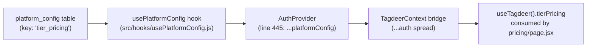

# PRICING_SYNC_SPEC.md — Pricing Page Synchronization Fix

## Problem Statement

The public `/pricing` page renders **duplicate tier cards** side-by-side (e.g., an English "Free" tier and an Arabic "Free" tier simultaneously). The grid layout also breaks when more than 3 cards render, causing the Enterprise card to awkwardly wrap below the others.

---

## Audit Findings — Root Cause Analysis

### Data Pipeline (How Tiers Reach the Public Page)



| Layer | File | Role |
|---|---|---|
| **DB** | `platform_config` table | Stores `tier_pricing` as a JSON blob (array of tier objects) |
| **Hook** | `src/hooks/usePlatformConfig.js` | Fetches all rows from `platform_config`, maps `tier_pricing` key → `tierPricing` state |
| **Context** | `src/context/providers/AuthProvider.jsx:445` | Spreads `...platformConfig` into context value |
| **Bridge** | `src/context/TagdeerContext.jsx:25` | Spreads `...auth` into the unified `useTagdeer()` |
| **Consumer** | `src/app/(consumer)/pricing/page.jsx:23` | Destructures `tierPricing` from `useTagdeer()` |
| **Admin** | `src/app/(portals)/admin/settings/page.jsx:209` | Saves `tierPricing` back to `platform_config` via `saveConfig('tier_pricing', tierPricing)` |

### Root Cause #1: No Tier Deduplication (THE DUPLICATE BUG)

**File:** `src/app/(consumer)/pricing/page.jsx`, lines 31–47

The admin settings page stores **one object per tier** with both language fields (`name` + `name_ar`, `features` + `features_ar`, `description` + `description_ar`). The public page is designed to handle this correctly via helpers like `getTierDescription()` (line 87) and `getTierFeatures()` (line 101).

**However**, the critical bug is on **line 31**:

```javascript
const activeTiers = tierPricing.filter(t => t.isActive !== false);
```

This filter does **not** deduplicate by `tier.id`. If the `tier_pricing` JSON blob in the database contains duplicate entries (e.g., two objects with the same tier level but different language fields, or if an admin accidentally created separate EN/AR entries), **all duplicates render as separate cards**.

Additionally, the hardcoded `freeTier` object (lines 32–45) uses `id: 'free'`, but if the database also contains a tier with `price: 0` or a tier named "Free"/"مجاني", **both** the hardcoded free tier AND the database free tier render — creating the visible duplication.

### Root Cause #2: Broken Dynamic Tailwind Grid Class

**File:** `src/app/(consumer)/pricing/page.jsx`, line 166

```javascript
<div className={`grid grid-cols-1 md:grid-cols-${Math.min(allTiers.length, 3)} ...`}>
```

Tailwind CSS purges classes at build time by scanning source files for **static, complete class strings**. The dynamic interpolation `` md:grid-cols-${...} `` generates classes like `md:grid-cols-2` or `md:grid-cols-3` at runtime — but **Tailwind never sees these complete strings in the source**, so they are purged from the production CSS bundle.

**Result:** The grid falls back to `grid-cols-1` on `md:` breakpoints, stacking all cards vertically, or rendering unpredictably depending on cached styles.

### Root Cause #3: No Fallback Safety

**File:** `src/hooks/usePlatformConfig.js`, line 12

```javascript
tierPricing: [],
```

If the database fetch fails (network error, RLS issue, etc.), `tierPricing` stays as `[]`. The pricing page then renders **only** the hardcoded `freeTier` — a single card in a grid designed for 3, which looks broken. There is no fallback array with representative tiers.

---

## Proposed Changes

> [!CAUTION]
> **NO-TOUCH ZONES:** Do NOT modify the `platform_config` Supabase table schema or any Stripe/payment processing logic.

---

### Fix 1: Deduplicate Tiers on the Public Page

#### [MODIFY] [page.jsx](file:///Users/tbs_capsule/Desktop/tagdeer/Tagdeer-platfom/src/app/(consumer)/pricing/page.jsx)

**Goal:** Ensure only one card renders per unique tier, and the hardcoded free tier does not conflict with a database free tier.

**Step 1 — Deduplicate by `id`:**

Replace lines 30–47 with logic that:

1. Filters `tierPricing` to active tiers only.
2. Deduplicates by `tier.id` using a `Map` (last-write-wins).
3. Checks if any database tier already has `price === 0` or `isFree === true`. If so, do **NOT** prepend the hardcoded `freeTier`.
4. If no free tier exists in the database, prepend the hardcoded one.

```javascript
// 1. Active tiers only, deduplicated by id
const seenIds = new Map();
(tierPricing || [])
    .filter(t => t.isActive !== false)
    .forEach(t => {
        if (t.id) seenIds.set(t.id, t);
    });
const uniqueActiveTiers = Array.from(seenIds.values());

// 2. Check if a free tier already exists in the DB data
const dbHasFreeTier = uniqueActiveTiers.some(
    t => t.isFree || t.price === 0
);

// 3. Hardcoded free tier fallback
const freeTier = {
    id: 'free',
    name: lang === 'ar' ? 'مجاني' : 'Free',
    price: 0,
    description: lang === 'ar'
        ? 'سجّل نشاطك التجاري مجاناً وابدأ باستقبال التفاعلات من الزبائن.'
        : 'Register your business for free and start receiving customer interactions.',
    features: lang === 'ar'
        ? ['فرع واحد', 'استقبال تقييمات المجتمع', 'مؤشر القدر الأساسي', 'إشعار عند وصول تقييم جديد']
        : ['1 location', 'Receive community reviews', 'Basic Gader Score', 'Notifications on new reviews'],
    isActive: true,
    isPopular: false,
    isFree: true
};

// 4. Final array: only prepend free tier if DB doesn't already have one
const allTiers = dbHasFreeTier
    ? uniqueActiveTiers
    : [freeTier, ...uniqueActiveTiers];
```

**Step 2 — Sort tiers by price ascending:**

After constructing `allTiers`, sort to guarantee visual order (Free → cheapest → most expensive):

```javascript
allTiers.sort((a, b) => (a.price || 0) - (b.price || 0));
```

---

### Fix 2: Replace Dynamic Tailwind Grid Class with Static Classes

#### [MODIFY] [page.jsx](file:///Users/tbs_capsule/Desktop/tagdeer/Tagdeer-platfom/src/app/(consumer)/pricing/page.jsx)

**Goal:** Use complete, static Tailwind class strings that survive purging.

Replace line 166:

```diff
- <div className={`grid grid-cols-1 md:grid-cols-${Math.min(allTiers.length, 3)} max-w-7xl mx-auto gap-8 mb-16`}>
+ <div className={`grid grid-cols-1 gap-8 mb-16 max-w-7xl mx-auto ${
+     allTiers.length === 2
+         ? 'md:grid-cols-2 lg:max-w-4xl'
+         : allTiers.length >= 3
+             ? 'md:grid-cols-3'
+             : 'md:grid-cols-1 lg:max-w-2xl'
+ }`}>
```

**Why this works:** Tailwind can now see the complete strings `md:grid-cols-2`, `md:grid-cols-3`, and `md:grid-cols-1` in the source file and will keep them in the production bundle.

**Additional layout guardrail:** If there are more than 3 tiers, cap at a 3-column grid and let them wrap naturally:

```javascript
allTiers.length >= 3 ? 'md:grid-cols-3' : ...
```

This prevents the Enterprise card from wrapping awkwardly — it will sit in row 2 of a 3-column grid instead.

---

### Fix 3: Admin-to-Public Field Mapping Verification

#### [MODIFY] [page.jsx](file:///Users/tbs_capsule/Desktop/tagdeer/Tagdeer-platfom/src/app/(consumer)/pricing/page.jsx)

**Goal:** Ensure every field saved in the Admin Settings maps correctly to the public card rendering.

The admin `handleAddTier()` (settings `page.jsx`, line 185) creates tiers with these fields:

| Admin Field | Public Page Usage | Status |
|---|---|---|
| `id` | `key={tier.id}` | ✅ Works |
| `name` | line 195: `tier.name` | ✅ Works |
| `name_ar` | line 195: `tier.name_ar` | ✅ Works |
| `description` | `getTierDescription()` | ✅ Works |
| `description_ar` | `getTierDescription()` | ✅ Works |
| `price` | line 222: `tier.price` | ✅ Works |
| `features` | `getTierFeatures()` | ✅ Works |
| `features_ar` | `getTierFeatures()` | ✅ Works |
| `isActive` | line 31: filter | ✅ Works |
| `isPopular` | line 168: badge render | ✅ Works |
| `isFreebie` | line 207: strikethrough price | ✅ Works |
| `originalPrice` | line 210: strikethrough display | ✅ Works |
| `allocations` | **NOT displayed** on public page | ⚠️ Intentional (internal config) |
| `duration` | **NOT displayed** on public page | ⚠️ Missing — hardcoded as "/mo" |

**Action Required:** The `duration` field is set to `'monthly'` by the admin but the public page hardcodes `/ mo` (line 225). If the admin ever sets `duration: 'yearly'`, the public display will be wrong.

Add a duration-aware label at line 225:

```javascript
{' '}/{tier.duration === 'yearly'
    ? (lang === 'ar' ? ' سنوياً' : ' yr')
    : (lang === 'ar' ? ' شهرياً' : ' mo')}
```

---

### Fix 4: Fallback Safety for Failed DB Fetch

#### [MODIFY] [page.jsx](file:///Users/tbs_capsule/Desktop/tagdeer/Tagdeer-platfom/src/app/(consumer)/pricing/page.jsx)

**Goal:** If `tierPricing` is empty or undefined (DB failure), display a clean, localized fallback array instead of a broken single-card layout.

Add a fallback constant **above** the deduplication logic:

```javascript
const FALLBACK_TIERS = [
    {
        id: 'fallback_starter',
        name: lang === 'ar' ? 'أساسي' : 'Starter',
        name_ar: 'أساسي',
        price: 49,
        description: lang === 'ar'
            ? 'مثالي للأنشطة التجارية ذات الفرع الواحد.'
            : 'Perfect for single-location businesses getting started.',
        features: lang === 'ar'
            ? ['فرع واحد', 'استقبال تقييمات المجتمع', 'مؤشر القدر الأساسي']
            : ['1 location', 'Community reviews', 'Basic Gader Score'],
        features_ar: ['فرع واحد', 'استقبال تقييمات المجتمع', 'مؤشر القدر الأساسي'],
        isActive: true,
        isPopular: false
    },
    {
        id: 'fallback_growth',
        name: lang === 'ar' ? 'نمو' : 'Growth',
        name_ar: 'نمو',
        price: 99,
        description: lang === 'ar'
            ? 'للعلامات التجارية المتنامية التي تدير عدة فروع.'
            : 'For growing brands managing multiple branches.',
        features: lang === 'ar'
            ? ['حتى 5 فروع', 'تقارير متقدمة', 'صفحة نشاط رقمية', 'دعم أولوية']
            : ['Up to 5 locations', 'Advanced reports', 'Digital storefront', 'Priority support'],
        features_ar: ['حتى 5 فروع', 'تقارير متقدمة', 'صفحة نشاط رقمية', 'دعم أولوية'],
        isActive: true,
        isPopular: true
    }
];

// Use fallback if DB returned nothing
const rawTiers = (tierPricing && tierPricing.length > 0) ? tierPricing : FALLBACK_TIERS;
```

Then use `rawTiers` instead of `tierPricing` in the deduplication logic from Fix 1.

> [!IMPORTANT]
> The fallback prices (49, 99) are **placeholder values**. The admin team should confirm the correct fallback prices before merging.

---

## Verification Plan

### Automated Checks

```bash
# 1. TypeScript / Type check
npx tsc --noEmit

# 2. Production build (ensures Tailwind purging works correctly)
npm run build

# 3. Unit tests still pass
npx vitest run
```

### Manual Verification

1. **Duplicate Bug:**
   - Open `/pricing` in both `?lang=ar` and `?lang=en`.
   - Confirm exactly **one card per tier level** renders (e.g., Free + Starter + Growth = 3 cards, not 6).
   - Toggle language — card content should switch, but card **count** must stay the same.

2. **Grid Layout:**
   - Resize browser from mobile → tablet → desktop.
   - On `md:` breakpoint and above, cards must display in a **symmetrical row** (2-col for 2 tiers, 3-col for 3+).
   - The "Enterprise" or last card must **not** wrap awkwardly below a half-empty row.

3. **Fallback Safety:**
   - Temporarily break the Supabase fetch (e.g., invalid env var) and reload `/pricing`.
   - Page must show the fallback tiers cleanly, not a blank or single-card layout.

4. **Admin Round-Trip:**
   - In Admin Settings → Pricing tab, edit a tier name and save.
   - Reload `/pricing` — the updated name must appear immediately.
   - Add a new tier in admin, toggle `isActive` off, reload `/pricing` — it must **not** appear.

---

## Files Modified (Summary)

| File | Change |
|---|---|
| `src/app/(consumer)/pricing/page.jsx` | Deduplication logic, static grid classes, duration label, fallback array |

**No other files need modification.** The admin settings page, `usePlatformConfig` hook, `AuthProvider`, and `TagdeerContext` are all functioning correctly. The bug is isolated entirely to the **consumer rendering layer**.
