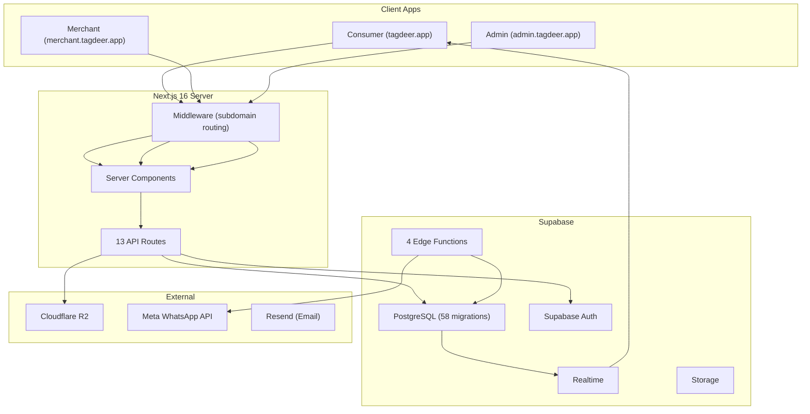

# 🦌 Tagdeer Platform — Full Executive & Technical Crew Analysis

**Date:** 2026-03-09  
**Project:** [Tagdeer Platform](file:///c:/Users/Mexyz/source/repos/Tagdeer-platfom) — Libyan Business Evaluation & Rewards  
**Stack:** Next.js 16 · React 19 · Supabase · Tailwind CSS · shadcn/ui · Cloudflare R2  
**Codebase:** ~153 source items, 58 DB migrations, 4 edge functions, 13 API routes

---

## Table of Contents

1. [Executive Summary](#executive-summary)
2. [Architecture Overview](#architecture-overview)
3. [Crew Perspectives](#crew-perspectives)
4. [Critical Security Vulnerabilities](#critical-security-vulnerabilities)
5. [Code Smells & Redundancies](#code-smells--redundancies)
6. [Logical Flaws & Potential Bugs](#logical-flaws--potential-bugs)
7. [Gaps & Missing Features](#gaps--missing-features)
8. [Risk Register](#risk-register)
9. [Recommendations Priority Matrix](#recommendations-priority-matrix)

---

## Executive Summary

Tagdeer is a **promising Libyan market fit** — a community-driven business review + loyalty rewards platform for Tripoli & Benghazi. However, the codebase reveals **significant security vulnerabilities, architectural inconsistencies, and scalability concerns** that must be addressed before production launch. The project has evolved rapidly from a Vite SPA to a Next.js 16 multi-tenant app, and the migration artifacts are visible in outdated documentation, duplicate tables, and mixed auth patterns.

> [!CAUTION]
> **There are 7 critical security issues** that could lead to data breaches, account takeover, or financial loss if exploited. These must be fixed before any public launch.

---

## Architecture Overview



| Component | Count | Health |
|-----------|-------|--------|
| API Routes | 13 | ⚠️ 3 unauthenticated, 1 SSRF |
| Edge Functions | 4 | ⚠️ No rate limiting, CORS `*` |
| DB Migrations | 58 | ⚠️ Schema drift, duplicate tables |
| UI Components | 75+ | ✅ Well-structured shadcn/ui |
| Lib Modules | 12 | ⚠️ Placeholder logic, weak crypto |
| Tests | ~4 files | 🔴 Critically insufficient |

---

## Crew Perspectives

### 🏢 CEO Perspective

**Market Fit:** Strong — Libya lacks a trusted review/rewards platform. The dual-city focus (Tripoli + Benghazi) is smart for MVP. The "Gader Score" gamification and Arabic-first UX are competitive differentiators.

**Concerns:**
- The platform is **not production-ready**. Launching with the current security posture risks brand destruction
- The **MIT license** is wrong for a commercial SaaS. Competitors can legally fork the entire platform
- README still references **Vite** while the app runs on **Next.js 16** — this signals internal misalignment
- No Terms of Service, GDPR/privacy compliance infrastructure, or content moderation pipeline
- **Revenue model** (subscription tiers) is implemented but the financial infrastructure is immature — no payment gateway integration, no invoicing

**Verdict:** *Delay launch by 4-6 weeks to fix security, then soft-launch in Tripoli only.*

---

### 🔧 CTO Perspective

**Architecture:** The mono-repo approach with Next.js subdomain routing is excellent for the team size. However:

1. **Auth Architecture is Split-Brained:**
   - Consumer: WhatsApp OTP → Edge Function → Profile-only (NO Supabase Auth session)
   - Merchant: Email OTP → Supabase Auth + Password fallback
   - Admin: Cookie-based UUID with profile role check
   
   Three different auth patterns creates massive attack surface and maintenance burden.

2. **The `TagdeerContext.jsx` is a 702-line God Component.** It holds auth, business data, real-time subscriptions, i18n, modals, and gamification all in one context. This will become unbearable at ~15 features.

3. **No Server-Side Rendering Strategy.** All data is client-fetched. For a public-facing review site, this kills SEO. The `(consumer)` section should leverage Next.js SSR/RSC.

4. **Real-time is over-scoped.** Subscribing to ALL business updates and ALL log inserts on the `businesses` and `logs` tables will not scale past 100 concurrent users.

**Verdict:** *Refactor auth into unified Supabase Auth flow. Split context into domain-specific providers. Add SSR for consumer pages.*

---

### 💰 CFO Perspective

**Cost Analysis:**
- **Supabase Free Tier** will be exhausted quickly once live:
  - `select *, logs(*)` on every page load fetches ALL logs for ALL businesses
  - Real-time on 2 channels × every user = aggressive connection count
  - Edge function invocations for every OTP = cost per user acquisition
- **Cloudflare R2** is cost-efficient for storage, good choice
- **Meta WhatsApp API** has per-message costs that aren't tracked or budgeted

**Revenue Risks:**
- Subscription tier upgrades use `is_trial: true` always — even admin-granted paid subs. This means the system cannot distinguish paid vs free users
- No payment integration exists — "Active" subscriptions are manually granted by admin
- Trial campaign system has **no abuse prevention** — the `userId` is client-supplied (see Security section)

**Verdict:** *Implement payment processing before launch. Add usage-based billing alerts. Fix the trial claim vulnerability immediately.*

---

### 👨‍💻 Senior Backend Developer Perspective

**API Route Issues (13 routes reviewed):**

| Route | Issue | Severity |
|-------|-------|----------|
| [business-stats](file:///c:/Users/Mexyz/source/repos/Tagdeer-platfom/src/app/api/consumer/business-stats/route.js) | POST with NO auth — anyone can increment stats | 🔴 Critical |
| [consumer/logs](file:///c:/Users/Mexyz/source/repos/Tagdeer-platfom/src/app/api/consumer/logs/route.js) | POST with service role key, no auth — spam vector | 🔴 Critical |
| [parse-catalog-feed](file:///c:/Users/Mexyz/source/repos/Tagdeer-platfom/src/app/api/merchant/parse-catalog-feed/route.js) | SSRF: fetches arbitrary URLs server-side | 🔴 Critical |
| [trial/claim](file:///c:/Users/Mexyz/source/repos/Tagdeer-platfom/src/app/api/merchant/trial/claim/route.js) | Trusts client-supplied `userId` — any user can claim as another | 🔴 Critical |
| [set-password](file:///c:/Users/Mexyz/source/repos/Tagdeer-platfom/src/app/api/merchant/set-password/route.js) | `listUsers()` scans ALL users to find by email — O(n) | 🟡 Medium |
| [set-password](file:///c:/Users/Mexyz/source/repos/Tagdeer-platfom/src/app/api/merchant/set-password/route.js) | Race condition: `setTimeout(1000)` to wait for trigger | 🟡 Medium |
| [subscriptions/grant](file:///c:/Users/Mexyz/source/repos/Tagdeer-platfom/src/app/api/admin/subscriptions/grant/route.js) | Service role client at module scope (no auth options) | 🟡 Medium |
| [admin/claims](file:///c:/Users/Mexyz/source/repos/Tagdeer-platfom/src/app/api/admin/claims/route.js) | Cookie existence check only — no role verification on GET | 🟡 Medium |
| All routes | Zero rate limiting | 🟡 Medium |
| All routes | No request size limits | 🟡 Medium |

**Database Concerns:**
- **Two competing tables for reviews:** `interactions` (original schema) and `logs` (added later). Both exist but the app primarily uses `logs`. The `interactions` table has 9,614 bytes of schema definition but appears unused in the codebase
- **58 migrations** with no squashing — new contributors face a wall of complexity
- The `profiles.email` column is `UNIQUE NOT NULL` but WhatsApp OTP creates profiles without emails via the edge function, which will cause insert failures
- `gader_points` is updated via client-side increment (`user.gader + 10`) without any server-side validation — race condition for concurrent votes

---

### ⚛️ Senior Next.js Developer Perspective

1. **Middleware Auth is Fragile:**
   - Admin auth checks `adminCookie.value !== 'true'` — double-negative logic. If value is any truthy string other than `'true'`, it's "authenticated"
   - Merchant auth checks for any cookie starting with `sb-` — doesn't validate the token
   - No CSRF protection on any form or API route

2. **No Loading States:** `TagdeerContext` starts `user` as `undefined` but no Suspense boundaries or loading skeletons exist. Users see flash of unauthenticated content.

3. **`'use client'` Everywhere:** Consumer layout, context, hooks — almost no server components are used. This defeats the purpose of Next.js 16's RSC architecture.

4. **Missing `next.config.js` Features:**
   - No `images` config for external image domains
   - No `middleware` config for CORS on API routes
   - Geolocation permissions blocked (`camera=(), geolocation=()`) but the app needs QR camera for merchant scanning

5. **The `useSupabase` Hook is a No-Op:** It imports a singleton and wraps it in `{ supabase }` — adds indirection with zero benefit.

---

### ☁️ Senior Vercel Expert Perspective

1. **Subdomain routing will fail on Vercel** without proper wildcard domain configuration. The middleware assumes `tagdeer.app` as root domain but there's no Vercel-specific domain config or `vercel.json`.

2. **Edge Functions are Supabase Edge, not Vercel Edge.** This is fine but means you're running two edge providers. OTP verification latency could be improved by moving to Vercel Edge Middleware.

3. **No caching strategy.** Business listings should be ISR (Incremental Static Regeneration) with revalidation — currently they're client-fetched every page load.

4. **Missing `headers()` CSP.** The security headers in `next.config.js` don't include Content-Security-Policy, which is critical for XSS prevention.

5. **Build will fail or warn** due to:
   - Mixed `.js` and `.ts` files with no consistent resolution
   - `tsconfig.json` configured for `"jsx": "preserve"` but many files are `.jsx` not `.tsx`
   - `vitest.config.js` references `@vitejs/plugin-react` which is for Vite, not Next.js

---

### 🏗️ Software Architect Perspective

**Core Architectural Issues:**

1. **No Domain Separation.** Gamification logic (trust engine, coupon engine, math engine) lives alongside UI utils. Extract to a shared `@tagdeer/core` package.

2. **Database Schema Divergence:**
   - `businesses` table has `recommends`/`complains` counters AND `logs` table with derived counts. Two sources of truth for the same data
   - `interactions` table and `logs` table are semantically identical but structurally different
   - `verified_users` table overlaps with `profiles` table functionality

3. **No Event-Driven Architecture.** Gader points awarding, coupon eligibility, tier promotion — all done imperatively in the client. Should be database triggers or event-driven RPCs.

4. **Missing API Versioning.** All routes are under `/api/` with no version prefix. Breaking changes will be impossible to manage.

5. **The MathEngine has Placeholder Logic:**
   ```typescript
   // mathEngine.ts
   const activeDecayFactor = 1.0; // Example placeholder
   const confidenceLevel = 0.5; // Example placeholder
   ```
   These are **core business metrics** that are hardcoded placeholders.

---

### 🔐 DevOps Engineer Perspective

1. **Hardcoded Supabase Anon Key in Source Code:**
   ```javascript
   // supabaseClient.js line 4
   const supabaseAnonKey = process.env.NEXT_PUBLIC_SUPABASE_ANON_KEY || 'eyJhbGciOiJIUzI1NiIs...';
   ```
   The fallback contains a **real JWT token** committed to Git. While anon keys are semi-public, this is bad practice and blocks key rotation.

2. **No CI/CD Pipeline.** The `.github/` directory has only a `workflows/` folder with 2 files but no actual workflow YAML was found for automated testing/deployment.

3. **20+ test files in project root** (`test_anon.js`, `test_rls.mjs`, `test_sql.mjs`, etc.) — debugging artifacts never cleaned up. These reference real Supabase endpoints.

4. **No `.env.example` File** despite README mentioning it. New developers cannot onboard.

5. **`kill_locks.js` in project root** — indicates the team has experienced database locking issues, likely from the singleton Supabase client pattern.

6. **No health check endpoint** for monitoring. No structured logging. No error tracking (Sentry/LogRocket).

---

### 📊 Technical & Business Analysts Perspective

**User Flow Gaps:**

| Flow | Status | Gap |
|------|--------|-----|
| Consumer registration | ⚠️ Partial | WhatsApp OTP works but doesn't create Supabase Auth session — consumer has no recoverable account |
| Merchant onboarding | ⚠️ Partial | Multi-step (OTP → claim → set password) but the "business claim" requires admin approval with no SLA |
| Business discovery | 🔴 Broken | `select *` fetches ALL businesses with ALL logs — no pagination, no search API |
| Coupon redemption | ⚠️ Partial | Serial code generation uses `Math.random()` — predictable and duplicates possible |
| Admin moderation | ⚠️ Partial | No content moderation queue beyond basic bad word filter |
| Subscription billing | 🔴 Missing | No payment integration — tiers are admin-granted only |
| Data export/GDPR | 🔴 Missing | No way for users to export or delete their data |

**Business Logic Issues:**
- **Anonymous vote limit** (3 per week) is stored in `localStorage` — clearing storage resets the limit
- **Device fingerprinting** is localStorage-based and trivially spoofable (clear storage = new device)
- **Content filter** uses substring matching — "class**ic**" would match "classic" as containing profanity
- **Coupon serial codes** have no collision detection — two concurrent requests could generate duplicates

---

### 🗄️ Supabase Senior Engineer Perspective

1. **RLS Policy Gaps:**
   - `profiles` table RLS is NOT in the base schema — it's in a later migration but may not cover all access patterns
   - `logs` table has NO RLS policy in the base schema (added in later migration)
   - `pre_registrations` allows PUBLIC INSERT with no validation — spam vector
   - Multiple API routes bypass RLS entirely using service role key without proper authentication

2. **Auth Architecture Mismatch:**
   - The WhatsApp OTP flow creates profiles WITHOUT `auth.users` entries (via service role INSERT)
   - But `profiles.id` references `auth.users(id)` with `ON DELETE CASCADE`
   - This means WhatsApp-only users have profiles that can't survive any auth table cleanup
   - Consumer `login()` function tries to INSERT into profiles with RLS enabled but using the anon client — this will fail unless RLS allows unauthenticated inserts

3. **No Connection Pooling:** `config.toml` has `pooler.enabled = false`. For production, PgBouncer should be enabled.

4. **Supabase Client Singleton Pattern** stores client on `window.tagdeer_supabase` — non-standard, fragile with HMR, and prevents proper SSR hydration.

5. **Email Confirmation Disabled:** `config.toml` has `enable_confirmations = false` — anyone can sign up with any email without verification.

6. **No Database Backups** configured in the project. The `config.toml` shows analytics disabled — no observability.

---

## Critical Security Vulnerabilities

> [!CAUTION]
> These must be fixed before ANY public-facing deployment.

### SEC-01: Unauthenticated Business Stats Manipulation
**File:** [business-stats/route.js](file:///c:/Users/Mexyz/source/repos/Tagdeer-platfom/src/app/api/consumer/business-stats/route.js)  
**Impact:** Anyone can send POST requests to arbitrarily inflate/deflate business scores  
**Fix:** Add authentication middleware, rate limiting, and verify the caller has a valid session

### SEC-02: SSRF in Catalog Feed Parser
**File:** [parse-catalog-feed/route.js](file:///c:/Users/Mexyz/source/repos/Tagdeer-platfom/src/app/api/merchant/parse-catalog-feed/route.js)  
**Impact:** Attackers can make the server fetch internal network resources, cloud metadata endpoints (`169.254.169.254`), or use the server as a proxy  
**Fix:** URL allowlisting, private IP blocking, domain validation

### SEC-03: Trial Claim Identity Spoofing
**File:** [trial/claim/route.js](file:///c:/Users/Mexyz/source/repos/Tagdeer-platfom/src/app/api/merchant/trial/claim/route.js)  
**Impact:** The `userId` is taken from the request body, not from the server session. Any user can claim trials on behalf of any other user  
**Fix:** Extract `userId` from the authenticated session/token, never from request body

### SEC-04: Hardcoded Supabase Key in Source
**File:** [supabaseClient.js](file:///c:/Users/Mexyz/source/repos/Tagdeer-platfom/src/lib/supabaseClient.js#L4)  
**Impact:** Key rotation is impossible without code deploy. Historical keys exposed in Git history  
**Fix:** Remove fallback, require env vars, rotate the exposed key

### SEC-05: WhatsApp OTP Uses Math.random()
**File:** [whatsapp-otp-send/index.ts](file:///c:/Users/Mexyz/source/repos/Tagdeer-platfom/supabase/functions/whatsapp-otp-send/index.ts#L30)  
**Impact:** `Math.random()` is not cryptographically secure. OTP codes could be predicted  
**Fix:** Use `crypto.getRandomValues()` or Deno's `crypto.randomInt()`

### SEC-06: CORS Wildcard on Edge Functions
**File:** [whatsapp-otp-send/index.ts](file:///c:/Users/Mexyz/source/repos/Tagdeer-platfom/supabase/functions/whatsapp-otp-send/index.ts#L5)  
**Impact:** `Access-Control-Allow-Origin: *` allows any website to call your OTP functions  
**Fix:** Restrict to `https://tagdeer.app` and `https://*.tagdeer.app`

### SEC-07: No Rate Limiting on OTP Endpoints
**Impact:** Attackers can brute-force 6-digit OTPs (1M combinations) or spam WhatsApp messages ($$ cost)  
**Fix:** Add per-phone rate limits (e.g., 3 OTPs per phone per hour, 5 attempts per OTP code)

---

## Code Smells & Redundancies

| Smell | Location | Description |
|-------|----------|-------------|
| **God Component** | [TagdeerContext.jsx](file:///c:/Users/Mexyz/source/repos/Tagdeer-platfom/src/context/TagdeerContext.jsx) | 702 lines, mixes auth + data + UI + gamification |
| **Dead Code** | `interactions` table | Created in schema, never used in app (replaced by `logs`) |
| **Dead Code** | `verified_users` table | Created in schema, never referenced in code |
| **No-Op Hook** | [useSupabase.js](file:///c:/Users/Mexyz/source/repos/Tagdeer-platfom/src/hooks/useSupabase.js) | 6-line wrapper that just re-exports a singleton |
| **Inconsistent Response** | API routes | Mix of `Response.json()` and `NextResponse.json()` |
| **Root Test File Sprawl** | Project root | 20+ `test_*.js` files — debugging artifacts left behind |
| **Duplicate Score Logic** | `mathEngine.ts` + `trustEngine.js` | Two separate weight/score calculation systems |
| **Inconsistent Naming** | Migrations | Mix of `_renamed` suffixes indicating schema drift |
| **README Drift** | [README.md](file:///c:/Users/Mexyz/source/repos/Tagdeer-platfom/README.md) | Documents Vite 7 stack but app uses Next.js 16 |
| **Mixed JS/TS** | `src/lib/` | `mathEngine.ts` and `utils.ts` alongside `.js` files |
| **Inline Supabase Client** | Multiple API routes | Each route creates its own `createClient()` — no shared factory |

---

## Logical Flaws & Potential Bugs

### BUG-01: Race Condition in Gader Points
**File:** [layout.jsx L149-153](file:///c:/Users/Mexyz/source/repos/Tagdeer-platfom/src/app/%28consumer%29/layout.jsx#L149-L153)  
Two concurrent votes will both read the same `user.gader` value and write `+10`, resulting in only one vote being counted.  
**Fix:** Use a Supabase RPC with `gader_points = gader_points + 10` (atomic increment).

### BUG-02: Content Filter False Positives
**File:** [contentFilter.js](file:///c:/Users/Mexyz/source/repos/Tagdeer-platfom/src/lib/contentFilter.js)  
Substring matching means "classic" matches "ass", "therapist" matches "crap". Arabic connected letter matching also fails for partial word matches.  
**Fix:** Use word-boundary regex or a proper NLP-based filter.

### BUG-03: Profiles Without Auth Users
The WhatsApp OTP verify edge function creates profiles with `gen_random_uuid()` as the `id`, but the `profiles` table has `id UUID PRIMARY KEY REFERENCES auth.users(id)`. This INSERT will fail because no corresponding `auth.users` row exists.  
**Fix:** Either create an `auth.user` in the OTP flow, or remove the FK constraint (danger).

### BUG-04: Anonymous Limit Bypass
**File:** [TagdeerContext.jsx L77-83](file:///c:/Users/Mexyz/source/repos/Tagdeer-platfom/src/context/TagdeerContext.jsx#L77-L83)  
The 3-vote anonymous limit is localStorage-only. Incognito mode, clearing storage, or switching browsers resets it. The server-side count via fingerprint is only checked in `refreshAnonInteractions`, which is never called before voting.  
**Fix:** Enforce limits server-side using the fingerprint or IP-based rate limiting.

### BUG-05: Coupon Expiry Cron N+1 Problem
**File:** [coupon-expiry-cron/index.ts](file:///c:/Users/Mexyz/source/repos/Tagdeer-platfom/supabase/functions/coupon-expiry-cron/index.ts#L35)  
Each expired coupon triggers 2 individual queries (update + RPC). For 1000 expired coupons, this is 2000 queries.  
**Fix:** Batch update with `IN` clause, use a single RPC that handles bulk operations.

### BUG-06: set-password `setTimeout(1000)` Race
**File:** [set-password/route.js L64](file:///c:/Users/Mexyz/source/repos/Tagdeer-platfom/src/app/api/merchant/set-password/route.js#L64)  
After creating an auth user, the code waits 1 second hoping the DB trigger creates the profile. Under load, this timing assumption will fail.  
**Fix:** Poll for profile creation with retry, or create the profile explicitly.

### BUG-07: Geolocation Blocked by Permissions-Policy
**File:** [next.config.js L11](file:///c:/Users/Mexyz/source/repos/Tagdeer-platfom/next.config.js#L11)  
`Permissions-Policy: camera=(), geolocation=()` blocks camera access, but the merchant QR scanner (`html5-qrcode` dependency) requires camera access.  
**Fix:** Allow camera on merchant subdomain: `camera=(self "https://merchant.tagdeer.app")`.

---

## Gaps & Missing Features

| Gap | Business Impact | Effort |
|-----|----------------|--------|
| No payment integration | Cannot monetize — subscriptions are admin-granted only | Large |
| No pagination on business listing | Page crashes at ~500 businesses | Medium |
| No SSR/SEO for consumer pages | Google cannot index businesses — kills organic growth | Medium |
| No email templates | Password reset, OTP, welcome emails are raw text | Small |
| No CDN for business images | All images served from Supabase Storage — slow | Medium |
| No analytics/tracking | No understanding of user behavior, funnel metrics | Small |
| No error boundary on merchant portal | Single error crashes entire portal | Small |
| No mobile responsiveness testing | Libyan market is ~85% mobile | Medium |
| No offline/PWA support | Critical for Libya's unstable internet | Large |
| No Arabic spell-check in content filter | Filter only works reliably for English substrings | Medium |
| No GDPR/data subject request flow | Legal liability in any EU-adjacent regulation | Large |
| No audit log for admin actions | Cannot trace who approved/rejected what | Medium |

---

## Risk Register

| # | Risk | Probability | Impact | Mitigation |
|---|------|-------------|--------|------------|
| R1 | Data breach via unauthenticated API routes | 🔴 High | 🔴 Critical | Fix SEC-01, SEC-02, SEC-03 immediately |
| R2 | OTP brute force / WhatsApp cost attack | 🔴 High | 🟡 High | Implement rate limiting (SEC-07) |
| R3 | Business score manipulation by competitors | 🔴 High | 🔴 Critical | Server-side auth on all vote endpoints |
| R4 | Supabase free tier exhaustion at launch | 🟡 Medium | 🟡 High | Add pagination, optimize queries, enable pooling |
| R5 | Schema migration failure in production | 🟡 Medium | 🟡 High | Squash migrations, add CI migration testing |
| R6 | Developer burnout due to monolithic context | 🟡 Medium | 🟡 Medium | Refactor TagdeerContext into domain providers |
| R7 | SEO invisibility due to client-side rendering | 🟡 Medium | 🟡 High | Implement SSR for public consumer pages |
| R8 | WhatsApp users losing access after auth cleanup | 🟡 Medium | 🔴 Critical | Fix BUG-03 (profiles ↔ auth.users FK) |
| R9 | Competitor forking codebase (MIT license) | 🟢 Low | 🟡 High | Change to proprietary or BSL license |
| R10 | Coupon serial collision causing fraud disputes | 🟡 Medium | 🟡 Medium | Add collision detection & crypto-random |

---

## Recommendations Priority Matrix

### 🔴 Immediate (Before Launch — Week 1-2)
1. **Fix all 7 Security Vulnerabilities** (SEC-01 through SEC-07)
2. **Add auth to all API routes** — extract `userId` from server session, never request body
3. **Add rate limiting** — at minimum on OTP send/verify and vote endpoints
4. **Remove hardcoded Supabase key** from source and rotate it
5. **Restrict CORS** on edge functions to `*.tagdeer.app`
6. **Fix Permissions-Policy** to allow camera on merchant subdomain

### 🟡 Short-Term (Launch Month — Week 3-6)
7. **Refactor `TagdeerContext`** into `AuthProvider`, `BusinessDataProvider`, `UIProvider`
8. **Add pagination** to business listings (cursor-based)
9. **Implement SSR** for consumer-facing pages (SEO critical)
10. **Add server-side atomic point increment** via RPC
11. **Clean up root test files** and establish proper test structure
12. **Squash migrations** and add CI migration testing
13. **Update README** to reflect actual Next.js 16 stack

### 🟢 Medium-Term (Month 2-3)
14. **Implement payment gateway** (Fawri/Local Libyan payment)
15. **Add error tracking** (Sentry) and structured logging
16. **Implement proper content moderation** pipeline (replace substring filter)
17. **Add proper device fingerprinting** (FingerprintJS or server-side)
18. **Create unified Supabase Auth flow** — eliminate WhatsApp profile-only path
19. **Enable connection pooling** in Supabase config
20. **Change license** from MIT to proprietary

---

> [!IMPORTANT]
> **Bottom Line from the Crew:** Tagdeer has strong product-market intuition and a thoughtfully designed gamification system. However, it has grown faster than its security and architectural foundations can support. The **7 critical security issues must be resolved before any public deployment.** With 4-6 weeks of focused engineering effort on the items above, this platform can be production-ready for a Tripoli soft launch.
